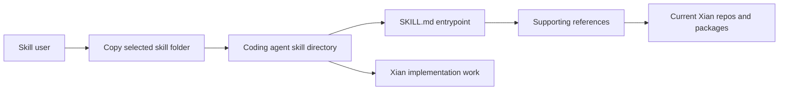

# xian-ai-skills

`xian-ai-skills` is a collection of AI-agent skills for the
[Xian](https://xian.org) blockchain. Each skill is a self-contained
folder with a `SKILL.md` and supporting references, designed to be
dropped into coding agents (Codex, Claude Code, and similar tools) so
the agent works from current Xian workflows instead of stale
repo-era guidance.

The repo is content, not runtime code. It contains no application
logic — just the skills agents read at prompt time.

## Skill Consumption Flow



## Quick Start

Copy the relevant skill folders into your agent's skills directory:

```bash
cp -r xian-sdk-skill        /path/to/agent/skills/
cp -r xian-node-skill       /path/to/agent/skills/
cp -r xian-dex-skill        /path/to/agent/skills/
cp -r xian-zk-skill         /path/to/agent/skills/
cp -r xian-bds-skill        /path/to/agent/skills/
cp -r xian-wallet-skill     /path/to/agent/skills/
cp -r xian-contract-skill   /path/to/agent/skills/
cp -r xian-governance-skill /path/to/agent/skills/
cp -r xian-release-skill    /path/to/agent/skills/
```

Each skill's `SKILL.md` is the entrypoint the agent reads. The
`references/` subfolder contains supporting material the skill points
to.

## Principles

- **Current workflows only.** Skills track the current package names
  (`xian-tech-py`, `xian-tech-cli`), current contract patterns
  (`con_*` naming, `LogEvent`, current XSC001 shape), and current
  operator surfaces (manifests, profiles, BDS snapshots).
- **uv for Python.** Python repos and examples use `uv sync`, `uv run`,
  `uv add`, or `uv tool install`. Do not recommend Poetry, Pipenv, ad hoc
  virtualenv setup, or direct package-manager rewrites in these skills.
- **CLI invocation is explicit.** Installed operator flows use the `xian`
  console command. Local source-tree flows use `uv run --project
  /path/to/xian-cli xian ...`.
- **Launch defaults stay conservative.** Draft mainnet manifests and privacy
  catalogs are launch-planning inputs, not permission to add public RPC defaults,
  public chain IDs, or approved mainnet proving artifacts to code examples.
- **One skill per surface.** Splitting by surface keeps prompt
  context tight: an agent doing DEX work does not need governance
  context bleeding in.
- **Drop-in, not auto-loaded.** Each skill is a folder you copy into
  the agent's skills directory. No global state, no installation.
- **References are referenced, not duplicated.** Skills point at
  external repos and PyPI packages instead of inlining code that
  rots.

## Skills

| Skill                                                       | Use it for                                                                                                                                  |
| ----------------------------------------------------------- | ------------------------------------------------------------------------------------------------------------------------------------------- |
| [`xian-sdk-skill`](./xian-sdk-skill/)                       | Build applications on Xian with the current Python SDK (`xian-tech-py`): helper clients, tx submission, chi estimation, source deploy, indexed reads. |
| [`xian-node-skill`](./xian-node-skill/)                     | Operate Xian nodes with the current CLI (`xian-tech-cli`) and stack model: join canonical networks, run validators / BDS nodes, attach optional relayer, dashboard, monitoring, and automation layers. |
| [`xian-dex-skill`](./xian-dex-skill/)                       | Work with the current Xian DEX: quote through `con_dex`, single-pair flows via `con_dex_helper`, LP-token-backed liquidity, indexed event reads. |
| [`xian-zk-skill`](./xian-zk-skill/)                         | Work with the current shielded-note privacy stack: deposit / transfer / withdraw, `xian-zk` wallet and proving APIs, relayer and ceremony constraints. |
| [`xian-bds-skill`](./xian-bds-skill/)                       | Use the indexed BDS read surface correctly: blocks, txs, events, token inventory, DEX candles, `shielded_wallet_history`, BDS snapshot recovery. |
| [`xian-wallet-skill`](./xian-wallet-skill/)                 | Work with current browser and mobile wallets: provider approvals, wallet-owned swaps, activity, WalletConnect, network settings, shielded backup. |
| [`xian-contract-skill`](./xian-contract-skill/)             | Write valid Xian smart contracts from a product spec: restricted contract source, storage/events/time/numeric patterns, local tests, and source deploy snippets. |
| [`xian-governance-skill`](./xian-governance-skill/)         | Work with current validator governance and operator lifecycle: membership, delegation, state-patch, evidence, slashing, and protocol-safety validation. |
| [`xian-release-skill`](./xian-release-skill/)               | Plan and create Xian releases in dependency order only after GitHub validations are green, including package dependency updates after provider releases. |

## Skill Layout

Each skill folder contains:

- `SKILL.md` — the canonical entrypoint the agent reads.
- `references/` — supporting docs, snippets, and pointers to external
  repos / packages.

## Validation

Skills are content. The validation gate is a careful re-read against
current behavior in the upstream repos when something changes there.
When a skill diverges from the current Xian stack, update it in the
same change set.

## Resources

- [xian.org](https://xian.org)
- [`xian-tech-py` on PyPI](https://pypi.org/project/xian-tech-py/)
- [`xian-tech-cli` on PyPI](https://pypi.org/project/xian-tech-cli/)
- [`xian-technology/xian-py`](https://github.com/xian-technology/xian-py)
- [`xian-technology/xian-cli`](https://github.com/xian-technology/xian-cli)
- [`xian-technology/xian-stack`](https://github.com/xian-technology/xian-stack)
- [`xian-technology/xian-dex`](https://github.com/xian-technology/xian-dex)
- [`xian-technology/xian-contracts`](https://github.com/xian-technology/xian-contracts)
- [`xian-technology/xian-contracting`](https://github.com/xian-technology/xian-contracting)
- [`xian-technology/xian-abci`](https://github.com/xian-technology/xian-abci)

## Related Docs

- [`../xian-ai-guides/README.md`](../xian-ai-guides/README.md) — context files (Contracting reference, BDS GraphQL schema) for general LLM use
- [`../xian-mcp-server/README.md`](../xian-mcp-server/README.md) — MCP server that exposes Xian to AI assistants programmatically

## License

MIT
